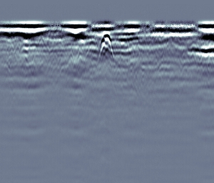
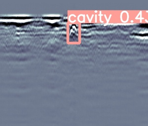
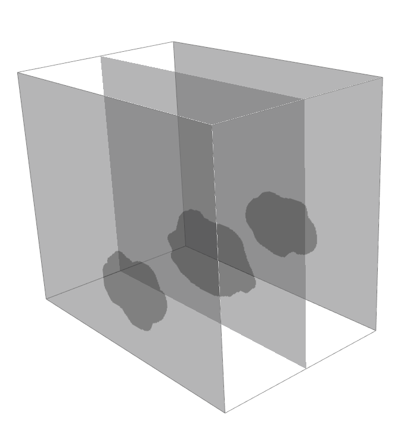
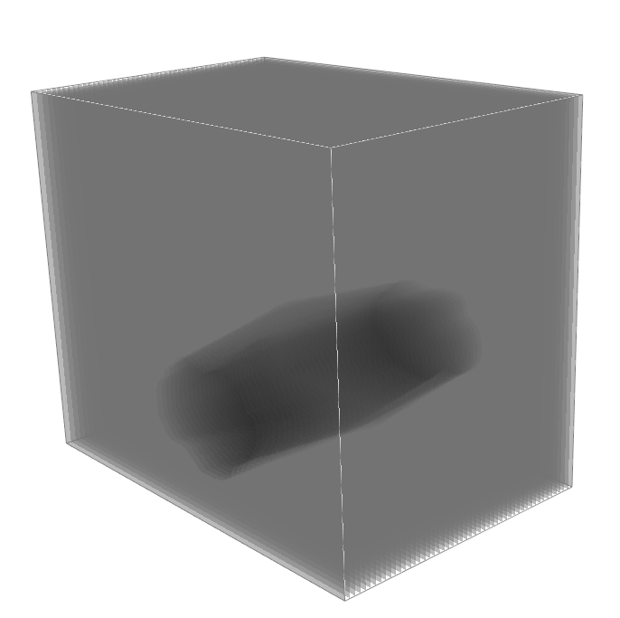
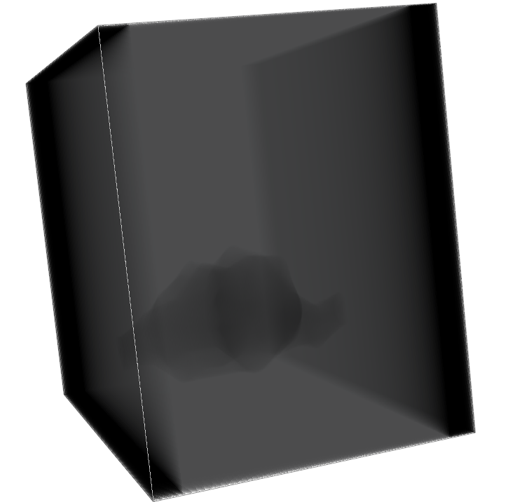

# 🛰️ GPR 3D Cavity Reconstruction

> 연속 GPR(B-scan) 데이터에서 공동(cavity) 가 포함된 단면을 자동 탐지하고,
> 선택된 단면으로부터 pixel-level segmentation mask 를 생성한 뒤,
> 단면 간 50cm 간격으로 인해 끊어져 보이는 cavity 구조를 SDT(Signed Distance Transform) 기반 보간으로
> 자연스럽게 연결하여 실제 지하 지형과 유사한 3D cavity volume을 복원·시각화하는 딥러닝 파이프라인

---

## 📖 프로젝트 개요 (Overview)

지표투과레이더(Ground Penetrating Radar, GPR)는 지하 공동(cavity), 공사 구멍, 매설물 등을 탐지할 수 있는 비파괴 검사 기술입니다.  
하지만 수천 장에 이르는 GPR 단면을 **전문가가 한 장씩 눈으로 판독**하는 것은 시간이 많이 들고, 사람마다 결과가 달라질 수 있습니다.
또한 연속 단면 사이에는 약 50cm 간격의 공백이 존재해, 공동이 실제로 이어져 있음에도 2D 단면에서는 끊어진 형태로 보이는 문제가 있습니다.

이 프로젝트는 다음과 같은 흐름으로 문제를 해결합니다.

1. **대량 GPR 연속 단면(연속 MALA 데이터)** 에 대해  
   AI Hub GPR 데이터로 학습된 **YOLO 기반 분류·탐지 모델**을 사용해  
   ⇒ 공동(cavity)이 탐지된 단면만 자동으로 골라냄.
2. 골라낸 cavity 단면들을 모아 **세그멘테이션용 데이터셋(data / data_mask)** 을 만들고,
3. **U-Net 기반 segmentation 모델**을 학습하여  
   ⇒ 각 단면에서 cavity의 **정확한 형태를 pixel 단위 mask로 예측**.
4. 예측된 mask는 이후 3D GPR 볼륨/지반 붕괴 시뮬레이션의 입력으로 사용할 수 있도록 설계.
5. 단면 간 50cm 간격으로 인해 끊어져 보이는 영역을 **SDT(Signed Distance Transform) 기반 보간**으로 
   자연스럽게 연결하여 실제 지하 공동과 유사한 연속 3D cavity structure 복원
6. 최종적으로 복원된 cavity volume을 PyVista로 3D 시각화

---

## 🔁 전체 파이프라인 (High-Level Pipeline)

1. **연속 GPR 데이터 수집**
   - 예: `gpr_data/cavity_yz_MALA_000001.jpg` ~ `..._002000.jpg`

2. **1단계 – 객체 탐지 / 분류 (YOLO, AI Hub 기반)**
   - AI Hub에서 제공하는 GPR dataset + 사전 학습된 YOLOv5 모델 사용
   - 클래스: `cavity`, `box`, `patch` 등
   - 결과: `runs/detect/exp*/labels/*.txt` (YOLO 포맷 라벨)

3. **cavity 단면 자동 필터링**
   - `filter_cavity_images.py`
   - YOLO 결과를 읽고, **cavity가 한 번이라도 검출된 이미지의 “원본”** 만
     `classification_cavity_img/` 폴더로 복사

4. **2단계 – 픽셀 단위 세그멘테이션 (U-Net)**
   - 학습용 데이터:  
     - `data/`: GPR 원본 이미지  
     - `data_mask/`: 해당 이미지의 cavity 영역을 채운 mask (`*_mask.jpg`)
   - `src/train.py`로 U-Net 학습 (BCE + Dice Loss, 간단한 데이터 증강 포함)

5. **cavity 단면에 대한 일괄 mask 생성**
   - `src/batch_inference.py`
   - 입력: `classification_cavity_img/*`  
   - 출력: `classification_cavity_mask/*_mask.png`
   - 나중에 이 mask들을 slice 방향으로 쌓아서 3D cavity volume을 만들 수 있음.

6. **SDT 기반 단면 보간 및 3D cavity 복원**
   - mask 단면 사이의 50cm 공백을 SDT로 연속 매핑
   - slice 간 중간 단면을 생성하여 끊어져 보이던 cavity 구조를 부드럽게 연결
   - 복원된 3D cavity volume을 PyVista로 시각화

---

## 📡 GPR Cavity Analysis Workflow (Full Pipeline)

### 1) GPR 전처리 및 cavity 마스킹

<div align="center">

<table>
  <tr>
    <td align="center">
      <br>
    </td>
    <td align="center">
      <br>
    </td>
    <td align="center">
      <br>
    </td>
  </tr>
  <tr>
    <td align="center">
      <sub><b>Step 1. 원본 GPR 단면</b></sub>
    </td>
    <td align="center">
      <sub><b>Step 2. cavity 탐지</b></sub>
    </td>
    <td align="center">
      <sub><b>Step 3. GPR cavity 마스크 생성</b></sub>
    </td>
  </tr>
</table>

</div>

---

### 2) SDT 보간 기반 3D cavity 복원

<div align="center">

<table>
  <tr>
    <td align="center">
      <br>
    </td>
    <td align="center">
      <br>
    </td>
    <td align="center">
      <br>
    </td>
  </tr>
  <tr>
    <td align="center">
      <sub><b>Step 4. 계측 간격으로 mask 배치</b></sub>
    </td>
    <td align="center">
      <sub><b>Step 5. SDT 보간으로 공백 연결</b></sub>
    </td>
    <td align="center">
      <sub><b>Step 6. 최종 3D 공동 복원</b></sub>
    </td>
  </tr>
</table>

</div>

---

<details>
<summary><strong>📂 폴더 구조 (Project Structure)</strong></summary>

```text
gpr_to_cavity/
├── continuous_data/                # 연속 GPR 원본(MALA) 이미지 전체
│   ├── cavity_yz_MALA_000001.jpg
│   └── ...
│
├── data2/                          # Segmentation 학습용 GPR 이미지
│   ├── cavity_yz_MALA_000228.jpg
│   └── ...
├── data2_mask/                     # Segmentation 학습용 GT 마스크
│   ├── cavity_yz_MALA_000228_mask.jpg
│   └── ...
│
├── classification_cavity_img/      # YOLO로 cavity가 검출된 원본 단면만 모은 폴더
├── classification_cavity_mask/     # 위 단면들에 대한 U-Net 예측 mask
│
├── checkpoints/
│   └── unet_best.pth               # 현재까지 가장 성능 좋은 U-Net 가중치
│
├── src/
│   ├── dataset.py                  # data / data_mask용 Dataset 클래스
│   ├── model.py                    # Lightweight U-Net 모델 정의
│   ├── train.py                    # U-Net 학습 스크립트 (BCE+Dice, 증강, Scheduler)
│   ├── batch_inference.py          # classification_cavity_img 전체에 대해 mask 예측
│   └── filter_cavity_images.py     # YOLO 결과에서 cavity 이미지만 추출하는 스크립트
│
├── ai_hub/
│   └── src/yolov5_master/          # (외부) AI Hub GPR 탐지 모델 코드 & weights
│       └── runs/detect/exp*/labels # YOLO detection 결과(txt)
│
├── visualization/                  # 예측된 mask들을 3D cavity volume으로 시각화/변환하는 모듈
│   ├── build_cavity_volume.py      # mask들을 쌓아 3D cavity voxel volume 생성
│   ├── view_cavity_volume.py       # PyVista 기반 3D cavity 렌더링
│   ├── view_cavity_slices_spacing.py # slice 간격/보간 실험용 시각화
│   └── cavity_volume.npy           # 생성된 3D voxel cavity 데이터
│
├── slice_interpolation/            # SDT 보간법을 사용하여 이미지 연결
│   ├── build_cavity_volume.py
│   ├── sdt_interpolation.py
│   └── visualize_interp.py 
│
├── outputs/
│   └── prediction_img/             # batch inference로 생성된 예측 mask 이미지 저장 폴더
│
├── note/                           # 실험 과정에서의 메모/기록 파일 모음
│
├── test/                           # 테스트용 코드 및 샘플 이미지/스크립트
│
└── README.md
```
</details>

--- 

## 🚀 향후 개선 사항 (Future Improvements)
1. **Multi-Frequency / Multi-Orientation 융합**
   - 단일 주파수·단일 방향 분석에서 벗어나,
     Dual/Multi-frequency 및 다른 방향(YX, ZX) GPR 단면을 함께 활용하여
     더 정확한 3D 지하 구조 복원이 가능합니다.

2. **SDT 보간 → Neural Implicit Field 기반 3D 복원**
   - 현재는 SDT(Signed Distance Transform) 보간을 사용하고 있으나,
     Neural SDF, NeRF 등 Neural Implicit Representation을 도입하면
     더 자연스럽고 실제 지반과 유사한 3D cavity mesh 생성이 가능합니다.

3. **GPR Raw Signal(Time-Series) 분석 활용**
   - Amplitude 이미지(B-scan)뿐 아니라
     원시 GPR 파형(Time-Series)을 함께 분석하면 재질 구분, 깊이 기반 반사 특성 분석, 노이즈 저감 등 고도화된 지반 분석이 가능해집니다.

4. **실시간 GPR Mapping 시스템으로 확장**
   - UGV/RC카 기반 플랫폼에 GPR을 탑재하여
     실시간 탐사 → 자동 분석 → 3D cavity 생성 → 위험 구간 표시
     까지 수행하는 end-to-end 시스템으로 확장할 수 있습니다.

5. **FEA 기반 지반 붕괴 시뮬레이션 연동**
   - 복원된 3D cavity volume을 FEA(Finite Element Analysis) 기반   
     모델과 연동하여 지반 붕괴·침하 가능성을 정량적으로 예측할 수 있습니다.